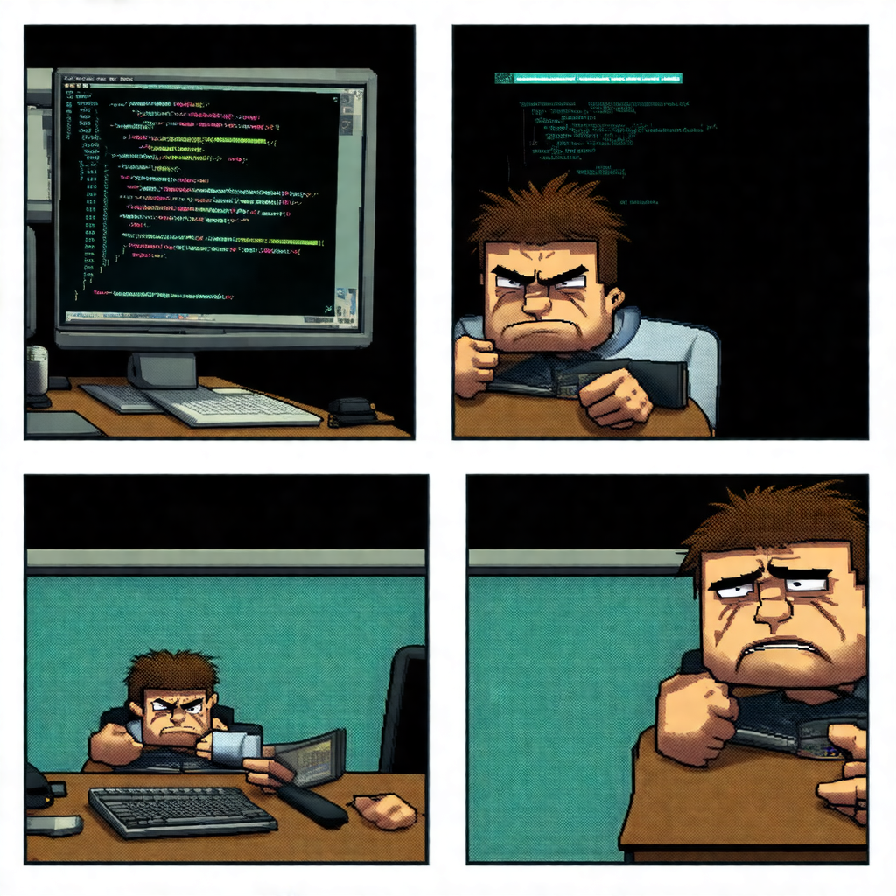

# Deadbit

I’ve always loved the idea of creating my own webcomic, but I’m not great at drawing. Thanks to diffusion models, I realised this might be the perfect time to jump right in. Naturally, as a software developer, my next logical step was to engineer all the fun out of it by using an LLM (**Qwen2.5**) and some Python to automate the entire process.

This program uses `Qwen/Qwen2.5-1.5B-Instruct` to create the script and `stabilityai/stable-diffusion-3.5-medium` to generate the images. The goal was to create a tool that could run on an RTX 3080 in about a minute. It’s mostly a collection of hacks and experiments that I’ve tidied up into something functional.

---

## License

While this software is licensed under MIT, the models and libraries used have their own licensing terms. Users should review these carefully, especially if you plan to build commercial systems.

---

## Setup

This project is a bit manual and requires a Hugging Face account. Deadbit was developed on **Ubuntu 24.04** and assumes certain system configurations.

### Steps
1. Clone the repository and navigate into the directory:
   ```bash
   $ git clone <repo-url>
   $ cd deadbit
   ```
2. Run the `setup.sh` script:
   ```bash
   $ python -m venv .venv
   $ source .venv/bin/activate
   $ pip install poetry
   $ poetry install
   ```

---

## Creating a Comic

Ensure you’re in the correct virtual environment and execute the program with Python:

```bash
$ source .venv/bin/activate
$ python deadbit
```

---

## Observations

### Outlines
[Outlines](https://dottxt-ai.github.io/outlines/latest/welcome/) is great for structuring data, but mileage varies based on your prompt. I noticed issues when the structure of the data model didn’t match the language in my prompt, leading to truncated results.

For example, using this data structure:
```python
class WebComic(BaseModel):
    title: str
    description: str
```
...with a prompt like "Write the content for a 4-panel comic..." caused the output to be incomplete. Ultimately, I dropped Outlines for this project, either it wasn’t well-suited for this task or I wasn’t using it correctly.

### Fine-Tuning
I experimented with fine-tuning to generate four distinct images per comic. Here, Outlines shone, helping me structure scripts like:
```python
class WebComic(BaseModel):
    panel1: str
    panel2: str
    panel3: str
    panel4: str
```
However, the results were lacklustre due to challenges in fine-tuning on an RTX 3080.

---

## Improvements

There’s still room for improvement, like generating titles and shorter descriptions for the CLIP model. That said, this project has already delivered what I set out to achieve.

---

## Example

The output varies greatly, and it often surprises me - sometimes it doesn’t even resemble a 4-panel comic. After a few runs, I generated the following script:

```
Panel 1: DeadBit, a software developer, sits at his desk with a frown on his face. He looks tired and stressed out from working late hours to meet project deadlines.

Panel 2: The screen flickers, showing a chaotic mess of code snippets. DeadBit squints in frustration, trying to decipher what's wrong with the latest bug he encountered.

Panel 3: In an attempt to fix the issue, DeadBit types furiously into his computer keyboard, creating more errors than fixes. His hair stands up in disarray, reflecting the stress of debugging.

Panel 4: Exhausted but determined, DeadBit finally manages to resolve the last bug. As he types the solution, his expression changes from frustrated to triumphant, revealing that he has saved the day once again.
```


